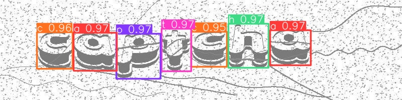
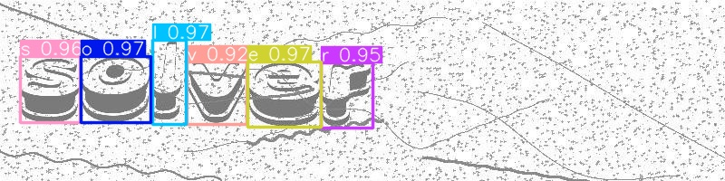
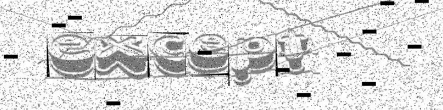
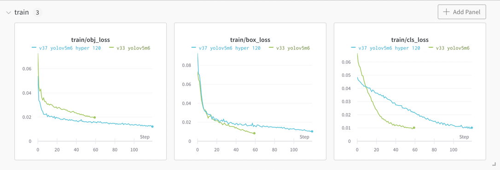

# CAPTCHA Solver

Automatic CAPTCHA solver using [YOLOv5](https://github.com/ultralytics/yolov5). Created for the NOTS project at [HAN](https://www.han.nl/).

Made by:
* Mike van Egmond
* Alex Cheng
* Steven Velderman
* Auke Onvlee

## Demo
See the code working in this [Google Colab Notebook](https://colab.research.google.com/drive/1JlLNy03KpM_E9oyB9TpQ-CFjR9vNj93i?usp=sharing).

## Weights
Weights are located in the weights folder. The version number is the version of the dataset used. Best performance was seen using v37-yolov5m6-hyper-300. This model was trained for 300 epochs over a period of 6 hours and 45 minutes using an Nvidia Tesla P100 GPU.

## Data labelling
Using [Roboflow](https://roboflow.com/) over 400 images were labelled by hand.

## Data Augmentation
To increase the dataset size data augmentation was used. Using [Roboflow](https://roboflow.com/) we went from 400 images to 1000+ images, greatly increasing the accuracy of the model. Several augmentations were used.

## Tracking performance
The performance of the models was tracked using [Weights and Biases](https://wandb.ai/site). This allowed us to see how well the model was doing and compare it to earlier runs.
